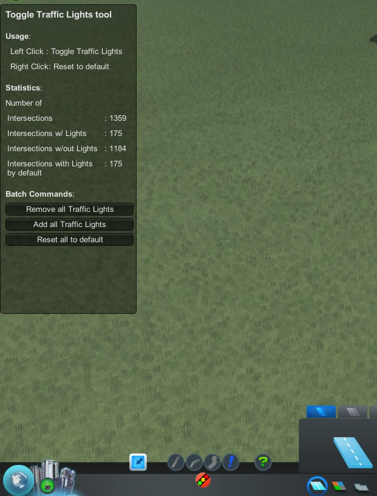

Toggle Traffic Lights
=====================
Mod for Cities:Skylines  
-> [on Steam Workshop](http://steamcommunity.com/sharedfiles/filedetails/?id=411833858)  

Tool to **remove or add traffic lights at intersection**. Traffic lights can be added and removed at any kind of road intersection including highways and their off- and on-ramps.
  

&nbsp;  

There are multiple ways to active this tool:
* You can click the **button in the roads menu** below the roads tool  

* Alternatively you can use the keyboard shortcut **Ctrl+T**. This acts exactly like clicking on the button. If the roads menu is not open when pressing the shortcut the menu will open. Pressing *Ctrl+T* again will deselect the Toggle Traffic Lights tool and closes the roads menu.
* The keyboard shortcut **Ctrl+Shift+T** will enable the tool too, but does not open the roads menu. That means there is no visual sign like a highlighted button, but the tool is fully active. Pressing *Ctrl+Shift+T* again (or *Ctrl+T*) disables the Traffic Light tool and reenables the last used tool. This shortcut is therefore useful for fast changes. Pressing the shortcut while the roads menu is active will act like clicking on the button or pressing  *Ctrl+T* -- with one exception: Pressing *Ctrl+Shift+T* while the tool is active in the roads menu will not close the menu (like *Ctrl+T* does) but selects the road building tool.  
Therefore this shortcut behaves similar to the Toggle Traffic Lights mod [before a button was added](https://github.com/Craxy/ToggleTrafficLights/releases/tag/0.2.0).

When the tool is active you can hover over an intersection. This intersection is then highlighted. The highlighting indicates the current status of the traffic light: light blue means there are traffic lights while dark blue shows that there is no traffic light. The same info is shown in the tooltip. Additional it displays the original state of the traffic lights on this intersection.  
To toggle the traffic lights **left click** on an intersection. Alternatively you can reset the traffic lights to its original state via a **right click**.  

With Cities:Skylines patch 1.10 tunnels were added to the game. **This mod supports tunnels since [version 0.7.0](https://github.com/Craxy/ToggleTrafficLights/releases/tag/0.7.0)**. To toggle lights underground the underground-mode must be activated via **PageDown**1. This enables the Traffic Info View and allows toggling of intersections in tunnels -- ONYL intersections in tunnels, NOT intersections overground. To go back to intersection above the ground use **PageUp**1. If you press **PageUp+PageDown**1 together you can change intersections above and below the ground at the same time.  
Although [Toggle Traffic Lights v. 0.7.0](https://github.com/Craxy/ToggleTrafficLights/releases/tag/0.7.0) supports tunnels, the functionality is still very basic. There are still some quirks in combination with tunnels:
* There is currently no real indicator which mode is used (underground, overground, both). Overground is easy distinguishable from the other modes since it doesn't use the Traffic Info View -- but the two other modes look the same. So you have to check by mouse hovering over an intersection above the ground. It's not true there's no sign: Using the UI (right click on button) displays the current mode under the headline in a very tiny font -- but that's something I don't want to keep. In a future version I might most likely add some real indicator.
* Hovering over an underground intersection highlights it -- but the highlighting is projected on the ground. Based on your camera the intersection might be quite distant from its highlighting. In future version I might use a similar approach the road-building tool does: It projects the highlight-circle on the ground, but on the same time it draws another circle to the correct position underground.
* The existence of traffic lights in tunnels are not visible. Therefore have to move your mouse over an underground intersection to see its current state. In future versions it'll be possible to highlight all intersections with their existence of lights.
* Pressing *PageUp+PageDown* can be a bit odd: If one of the two buttons gets released a bit earlier than the other the mode of the last button gets activated. Maybe I'm going to adjust that in later versions of the game -- but it's of no high priority. Maybe I will asign that tool to a separate key. Additional: with an indication of the current mode I'm planning on introduce a button to change the mode so it can be used without a shortcut.

With [version 0.4.0](https://github.com/Craxy/ToggleTrafficLights/releases/tag/0.4.0) batch commands were introduced. With these all traffic lights can be removed, reset to their game-default or added to all intersections. These commands can be accessed via a right click in the Toggle Traffic Lights tool button. A menu with the commands opens on the left side of the screen.  
  
Please note: A batch command gets executed immediately after you clicked the corresponding button. There is no revert. There are some [additional remarks](https://github.com/Craxy/ToggleTrafficLights/releases/tag/0.4.0) witch can be found in the [release notes](https://github.com/Craxy/ToggleTrafficLights/releases/tag/0.4.0).  

**Note**: The existence of traffic lights will be added to new savegames (the savegame size increases by a couple of kB (~33kB) -- I think that's negligible). The savegame can be loaded without the mod enabled but in this case the traffic lights will be reset to it's original statuses (see [this table](https://www.reddit.com/r/CitiesSkylines/comments/2zp61z/i_made_a_table_chart_of_which_intersections/) for the default statuses).  

Note: If you append or remove a road to/from an intersection the traffic lights will be recalculated by the game and placed according to the used road types. You must then retoggle the traffic lights via this tool.  

Note: The tool is disabled in the editors.

&nbsp;  
&nbsp;  
#### Shortcut reference:
* **Ctrl+T**: Activate/Deactivate TTL by selection the TTL button in the roads menu
* **Ctrl+Shift+T**: Activate/Deactivate TTL without using the button
* **Left Click**: Toggle traffic light
* **Right Click**: Reset traffic light to its default state
* **PageDown**: Activate mode to toggle lights in tunnels
* **PageUp**: Activate mode to toggle lights above the ground
* **PageUp+PageDown**: Activate mode to toggle lights above and below the ground

&nbsp;  
&nbsp;  
### Issues with other mods
* [Extended Road Upgrade](https://steamcommunity.com/sharedfiles/filedetails/?id=408209297): **Both mods work side by side**. There is just one issue: When one of the Extended Road Upgrade tool is activated you cannot enable directly the Traffic Lights tool -- even if you click the button one of the road tools gets enabled. Just active the Traffic Lights tool again and it'll work.
* [Lane Changer](https://steamcommunity.com/sharedfiles/filedetails/?id=412101021): This mod is not compatible with Toggle Traffic Lights. I have not inspected the problem -- but it seems both mods modify the same data and thwart each other. Recently there were comments of the two mods working together -- I have not tested both together yet.

&nbsp;  
&nbsp;

## Release Notes
For release notes see: [GitHub release page](https://github.com/Craxy/ToggleTrafficLights/releases) or [Change Notes on Steam](https://steamcommunity.com/sharedfiles/filedetails/changelog/411833858)

&nbsp;  
&nbsp;

### Additional Infos
* Some code is inspired by the mod "Extended Road Upgrade" by viakmaky: https://github.com/viakmaky/Skylines-ExtendedRoadUpgrade (MIT licence)
* Some code is taken from or inspired by the mod "ModTools" by nlight: https://steamcommunity.com/sharedfiles/filedetails/?id=409520576 (MIT licence)

&nbsp;  
&nbsp;
&nbsp;  
&nbsp;

1 Although I wrote *PageUp* and *PageDown* this mod actual utilizes the game's "Build Elevation Up" and "Build Elevation Down" keys (used to change elevation of roads while building). Their default states are *PageUp* and *PageDown*, but can be rebind in the Options menu under "Gameplay" -> "Key Mapping".
