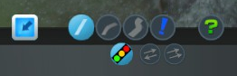

Toggle Traffic Lights
=====================
Mod for Cities:Skylines
-> [on Steam Workshop](http://steamcommunity.com/sharedfiles/filedetails/?id=411833858)

Tool to **remove or add traffic lights at intersection**. Traffic lights can be added and removed at any kind of road intersection including highways and their off- and on-ramps.

In game the tool can be activated via a **button in the roads menu** below the roads tool or via the **Ctrl+T**.  
  
When you hover over an intersection it will be highlighted. Both the highlight and the ToolTip will show the current Traffic Light status (has traffic light (light blue) or not (dark blue)). Via a left mouse click you can toggle between traffic lights and no traffic lights. To disable this tool simply select another tool or press Ctrl+T again.

**Note**: The existence of traffic lights will be added to new savegames (the savegame size increases by a couple of kB (~33kB) -- I think that's negligible). The savegame can be loaded without the mod enabled but in this case the traffic lights will be reset to it's original statuses (see [this table](https://www.reddit.com/r/CitiesSkylines/comments/2zp61z/i_made_a_table_chart_of_which_intersections/) for the default statuses).

Note: If you append or remove a road to/from an intersection the traffic lights will be recalculated by the game and placed according to the used road types. You must then retoggle the traffic lights via this tool.

Note: The tool is disabled in the editors.

## Known Issues & Further Work
This mod is currently a very early version! Toggling the traffic lights works already but there are some issues and further work: https://github.com/Craxy/ToggleTrafficLights/issues

### Issues with other mods
* [Extended Road Upgrade](https://steamcommunity.com/sharedfiles/filedetails/?id=408209297): **Both mods work side by side but the display of the button for this mod will not work correct.** ERU is grabbing all tool changes of the default road tools and reverts the selected button if ERU is not enabled. Therefore whenever the Traffic Lights button is clicked the ERU reverts the selected button to the last selected one of the built-in tools. Because of this when ERU is detected the built-in buttons will not visually deselected and therefore the Traffic Lights button and a built-in button will be highlighted simultaneous:  
  
The functionality of the Traffic Lights tool is not affected. But deselecting the tool by clicking on the other selected button is not possible -- click on another button first. Additional changing from one of the ERU tools to traffic lights directly is not -- it will automatically select one of the default tools. Click again on the Traffic Lights button to enable the tool.
 * [Lane Changer](https://steamcommunity.com/sharedfiles/filedetails/?id=412101021): This mod is not compatible with Toggle Traffic Lights. I have not inspected the problem -- but it seems both mods modify the same data and thwart each other. Recently there were comments of the two mods working together -- I have not tested both together yet.

## Release Notes
### 0.1.0 (2015-03-22)
* Initial Release

### 0.2.0 (2015-03-23)
* Ctrl+T now toggle the tool on/of (returns to the previous selected tool)
* Disabled tool inside the editors
* Traffic lights outside the buildable area cannot be toggled anymore

### 0.3.0 (2015-03-29)
* Added button in the roads menu
* Added message for errors while saving/loading
* Shortcut (Ctrl+T) now recognized right Ctrl too

### 0.3.1 (2015-03-30)
* Unloading of mod (to main menu or to desktop) fixed

### 0.3.5 (2015-03-30)
* Added highlighting of intersection
* Only road intersections are now recognized

### Additional Infos
* Some code is taken from or inspired by the mod "Extended Road Upgrade" by viakmaky: https://github.com/viakmaky/Skylines-ExtendedRoadUpgrade (MIT licence)
