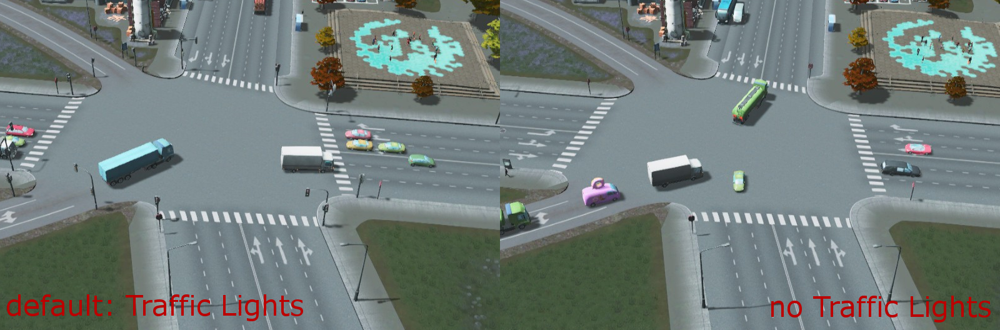
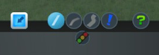
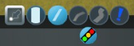

Toggle Traffic Lights
=====================
Mod for Cities:Skylines  
-> [on Steam Workshop](http://steamcommunity.com/sharedfiles/filedetails/?id=411833858)  

Tool to **remove or add traffic lights at intersection**. Traffic lights can be added and removed at any kind of road intersection including highways and their off- and on-ramps.
  

There are multiple ways to active this tool:
* You can click the **button in the roads menu** below the roads tool  

* Alternatively you can use the keyboard shortcut **Ctrl+T**. This acts exactly like clicking on the button. If the roads menu is not open when pressing the shortcut the menu will open. Pressing *Ctrl+T* again will deselect the Toggle Traffic Lights tool and closes the roads menu.
* The keyboard shortcut **Ctrl+Shift+T** will enable the tool too, but does not open the roads menu. That means there is no visual sign like a highlighted button, but the tool is fully active. Pressing *Ctrl+Shift+T* again (or *Ctrl+T*) disables the Traffic Light tool and reenables the last used tool. This shortcut is therefore useful for fast changes. Pressing the shortcut while the roads menu is active will act like clicking on the button or pressing  *Ctrl+T* -- with one exception: Pressing *Ctrl+Shift+T* while the tool is active in the roads menu will not close the menu (like *Ctrl+T* does) but selects the road building tool.  
Therefore this shortcut behaves similar to the Toggle Traffic Lights mod [before a button was added](https://github.com/Craxy/ToggleTrafficLights/releases/tag/0.2.0).

When the tool is active you can hover over an intersection. This intersection is then highlighted. The highlighting indicates the current status of the traffic light: light blue means there are traffic lights while dark blue shows that there is no traffic light. The same info is shown in the tooltip. Additional it displays the original state of the traffic lights on this intersection.  
To toggle the traffic lights **left click** on an intersection. Alternatively you can reset the traffic lights to its original state via a **right click**.  

**Note**: The existence of traffic lights will be added to new savegames (the savegame size increases by a couple of kB (~33kB) -- I think that's negligible). The savegame can be loaded without the mod enabled but in this case the traffic lights will be reset to it's original statuses (see [this table](https://www.reddit.com/r/CitiesSkylines/comments/2zp61z/i_made_a_table_chart_of_which_intersections/) for the default statuses).  

Note: If you append or remove a road to/from an intersection the traffic lights will be recalculated by the game and placed according to the used road types. You must then retoggle the traffic lights via this tool.  

Note: The tool is disabled in the editors.  

## Known Issues & Further Work
This mod is currently a very early version! Toggling the traffic lights works already but there are some issues and further work: https://github.com/Craxy/ToggleTrafficLights/issues

### Issues with other mods
* [Extended Road Upgrade](https://steamcommunity.com/sharedfiles/filedetails/?id=408209297): **Both mods work side by side**. There is just one issue: When one of the Extended Road Upgrade tool is activated you cannot enable directly the Traffic Lights tool -- even if you click the button one of the road tools gets enabled. Just active the Traffic Lights tool again and it'll work.
* [Lane Changer](https://steamcommunity.com/sharedfiles/filedetails/?id=412101021): This mod is not compatible with Toggle Traffic Lights. I have not inspected the problem -- but it seems both mods modify the same data and thwart each other. Recently there were comments of the two mods working together -- I have not tested both together yet.

## Release Notes
For release notes see: [GitHub release page](https://github.com/Craxy/ToggleTrafficLights/releases) or [Change Notes on Steam](https://steamcommunity.com/sharedfiles/filedetails/changelog/411833858)

### Additional Infos
* Some code is taken from or inspired by the mod "Extended Road Upgrade" by viakmaky: https://github.com/viakmaky/Skylines-ExtendedRoadUpgrade (MIT licence)
