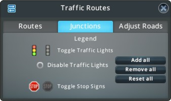
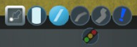

Toggle Traffic Lights
=====================
Mod for Cities:Skylines  
-> [on Steam Workshop](http://steamcommunity.com/sharedfiles/filedetails/?id=411833858)  

Tool to **remove or add traffic lights at junctions**. With Cities:Skylines patch [*1.7.0* (*Mass Transit*)](https://forum.paradoxplaza.com/forum/index.php?threads/mass-transit-1-7-0-patch-notes.1022869/) that functionality was directly included into the game. But *Toggle Traffic Lights* provides functions beyond of C:S:
* Access the Junction Tool directly from the Roads Menu.
* Activate and Deactivate the Junction Tool everywhere. Disabling the Intersection Tool restores the previous used tool.
* Instead of just the white info mode you can use the Junction Tool in the default (colored) view.
* Remove (or add or reset) all traffic lights at once.
* Disable creation of traffic lights at new junctions. 

# Description
TTL provides access to two slightly different tools: The C:S built-in *Traffic Routes - Junctions Info View*, and the Junction Tool.
Bot activate the same tool to toggle traffic lights and stop signs. The difference between these two are:
* *Traffic Routes - Junctions Info View*: Opens the C:S built-in *Traffic Routes - Junctions* tool. Enables the Info View (everything's painted in white). Opens the Traffic Routes Window with the Junctions tab selected. Contains batch commands to add, remove or reset all Traffic Lights.  
  
* *Junction Tool*: Provides different views: The same Info View used by *Traffic Routes - Junctions*, the default (colored) overground View, and the default View with tunnels (see image below).
  

## Batch Commands
  
TTL adds three buttons to the *Traffic Routes - Junctions* window: 
* *Add all*: Add Traffic Lights to all junctions.
* *Remove all*: Remove Traffic Lights from all junctions.
* *Reset all*: Reset all junctions to their default Traffic Lights states (see [this table](https://www.reddit.com/r/CitiesSkylines/comments/2zp61z/i_made_a_table_chart_of_which_intersections/) for the default statuses).

Besides the buttons you can also click on the icons while holding *Ctrl*. The colored traffic light adds lights to all intersection, the grayed out light removed lights from all intersections, and clicking on the text "Toggle Traffic Lights" resets all junctions to their default states.  

**Note**: All of these commands are executed immediately after you clicked the corresponding button. There's neither an additional confirmation nor a revert.

**Note**: These commands apply to all placed road junctions at the time you clicked on a command. Future created or changed junctions aren't affected by this. You have to execute the command again.

### Disable Traffic Lights
When the checkbox is checked new junctions are always created without traffic lights.
Existing Traffic Lights aren't touched by this option. Neither does it prevent manual toggling of traffic lights. All it does is ensure all newly created junctions don't have traffic lights.

**Note**: This is set on a per savegame basis and is not a global setting! That means you can play one map with this option enabled (-> no traffic lights for new junctions), while on another map you use the default C:S behavior.

## Activation
  
TTL adds an additional button to the Roads Menu. A left click opens the Junction Tool, a right click opens the (C:S) *Traffic Routes - Junctions Info View* with the batch commands.

**Note**: There's a slight visual issue: The Road Form Tab button doesn't get deselected when the Junction Tool is active. Neither will changing the Road Form reselect the Road Building Tool. Instead click again on the TTL button to disable the tool.

Additional the tools can be activated (and disabled) via shortcuts:
- **Ctrl+T**: Activates the Junction Tool. Opens the Roads Menu. If the junction tool is active this shortcut selects the Road Building Tool.
- **Ctrl+Shift+T**: Activates the Junction Tool. Doesn't open the Roads Menu instead it keeps the current location. Pressing the shortcut again reselects the previous tool.
- **Ctrl+Alt+T**: Opens the Traffic Routes Junctions Info View. Like the shortcut above it keeps the current location and using the shortcut again reselects the previous tool too.

The shortcuts can be changed in the settings.

**Note**: The Elevation shortcuts are displayed under the Toggle Traffic Lights settings, but cannot be modify. To change these go to the C:S Keymapping settings (category: shared). 

## Usage
Toggling Traffic Lights and stop signs works everywhere exactly like it already does with the built-in tool in C:S.

If the Junction Tool is enabled, you can change the view via the Elevation Keys (default: *PageUp* and *PageDown*). 
The order is: Overground, Overground with tunnels visible, Underground (Info Mode, white).
By default activating the Junction Tool keeps the current view: If an Info Mode was active, the tools uses the Underground view, otherwise the Overground view (with tunnels visible).  This behavior can be changed in the settings. Then the Junction Tool always uses the view of when it was active the last time. Whatever the setting the views can still be changed via the Elevation keys.

&nbsp;
&nbsp;
&nbsp;

# Release Notes
For release notes see: [GitHub release page](https://github.com/Craxy/ToggleTrafficLights/releases) or [Change Notes on Steam](https://steamcommunity.com/sharedfiles/filedetails/changelog/411833858)

&nbsp;
&nbsp;

# Additional Infos
* The states of the traffic lights from previous savegames with TTL get discarded. Between the release of the 1.7 patch (which remembers traffic lights) and the update of TTL for that patch quite some time passed. So -- if you have continued to play -- you quite likely already changed traffic lights with the C:S built-in function. Additional it's easier for me to just ignore separately by TTL stored lights instead of testing if these are present and handle them correctly.
&nbsp;
* Some code is inspired by the mod "Extended Road Upgrade" by viakmaky: https://github.com/viakmaky/Skylines-ExtendedRoadUpgrade (MIT licence)
* Some code is taken from or inspired by the mod "ModTools" by nlight: https://steamcommunity.com/sharedfiles/filedetails/?id=409520576 (MIT licence)
* Harmony is used for redirecting method calls: https://github.com/pardeike/Harmony (MIT licence)
  * A modded Harmony version is used:
    * with the ability to revert patched: https://github.com/pardeike/Harmony/pull/26 https://github.com/pardeike/Harmony/pull/26/commits/7e923bf2522ec24187f62344e816045ce284051d by [rumkex](https://github.com/rumkex/Harmony/tree/feature-patch-restoration)
    * a lot of classes/methods not used by TTL removed like everything regarding prefix call: https://github.com/Craxy/Harmony/tree/prefix-only
